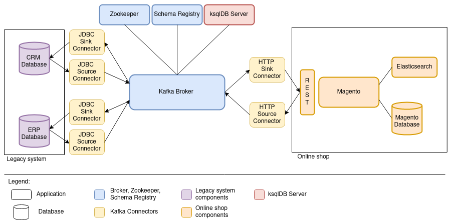

:toc:
:toc-title:
:toclevels: 2
:sectnums:
= Bachelor Thesis: Integration of a Process-driven Application into an Event Streaming Platform

This repository includes the setup and implementation for the Bachelor thesis "Integration einer prozessgesteuerten Anwendung in eine Event-Streaming-Plattform" (German) / "Integration of a Process-driven Application into an Event Streaming Platform", submitted to the Frankfurt University of Applied Sciences.

== Architecture
The high-level integration architecture of this project looks like below:

== Goal / Ziel
The goal of this thesis is to investigate how a process can be implemented and controlled in an application integration. This is done with the help of the pattern choreography and using Apache Kafka and ksqlDB. The goal is not to perform a full integration, because that would also require implementing a solution for integrating products and orders. The study is done only on the example of the process for transferring customer data. Updates and deletions of customer data are only marginally considered.

Further details can be found in the paper of this thesis.

--- German --- + 
Das Ziel dieser Thesis ist es zu untersuchen, wie ein Prozess in einer Anwendungsintegration umgesetzt und gesteuert werden kann. Dies geschieht mit Hilfe des Musters Choreografie und unter Verwendung von Apache Kafka und ksqlDB. Ziel ist es nicht, eine vollständige Integration durchzuführen, denn dafür müsste auch eine Lösung für die Integration von Produkten und Bestellungen implementiert werden. Die Untersuchung erfolgt nur am Beispiel des Prozesses zum Übertragen von Kundendaten. Aktualisierungen und Löschungen von Kundendaten werden nur am Rande betrachtet.

Weitere Details finden sich in der Ausarbeitung dieser Thesis.

== Prerequisites
=== Credentials
This setup requires access to some credentials:

*Adobe Magento Marketplace and Access Keys* +
This project requires the Magento extension `mageplaza/module-customer-approval` which is only available at the Magento Marketplace. Therefore, a Magento Marketplace account is required and the extension needs to be added to your account. The extension is completely free of charge and no payment information needs to be provided for this step. +
The access keys of your account need to be copied into a new file called `auth.json` within the `/magento` folder. A template for this file is available at `magento/auth.template.json`.

*Mail Account Information* +
The Magento web shop sends multiple mails to customers and administrators, e.g., when a new customer registers or to confirm a mail address. Therefore, this project requires at least four different mail accounts: three mail accounts for customers and one administrator mail account. All e-mails will be sent via the administrator mail account. + 
For the sake of simplicity, this project uses the mail server of Gmail. In order to configure Magento accordingly, the mail address and password of a Gmail account needs to be known. The security preferences of the Gmail account must allow connections from Magento.

=== Technical Prerequisites
- Docker and docker-compose
- the setup was tested on Ubuntu (20.04.3)
- the setup needs to be started using a stable internet connection to download all docker images and dependencies
- the ports listed in the section "Service Access" need to be available

== Installation Guide
=== Installation
1) Start all components using the setup script. Beforehand, make sure that the script is executable. +
[source, bash]
----
chmod +x setup.sh
./setup.sh -s
----
Remark: The containers will expose multiple ports. To ensure that the applications are available from your host, make sure that the ports documented in the section "Service Access" are available.

2) Wait until all components are in a healthy state. This can be checked using:
[source, bash]
----
docker ps
----

3) Execute the steps explained in "Installation of Extensions".

4) Navigate to http://localhost/admin and log in as admin user (username: user, password: bitnami1).

5) In Magento, navigate to System > Integrations. Add a new integration with the name "kafka" and make sure to select "All" as resource access property. Activate it and copy the API Access Token. + 
Replace the variable BEARER_TOKEN with the token within the following files:

- connect/distributed/config/connector-http-source-magento.json
- connect/distributed/config/connector-http-sink-magento-post.json
- connect/distributed/config/connector-http-sink-magento-put.json

6) Configure the SMTP extension like described in "SMTP Configuration".

7) In Magento, navigate to Stores > Configuration > Customers > Customer Configuration > Create New Account Options. Scroll down and set "Require Emails Confirmation" to "Yes". Save the configuration.

8) In Magento, navigate to Stores > Configuration > General > Store Email Addresses. Change all service mail addresses to the email address of this project. Save the configuration.

9) Deploy the Kafka topics, Kafka Connect and the connectors:
[source, bash]
----
./setup.sh -a
----

10) Deploy all KSQL statements:
----
./ksql-statements-deploy.sh
----

If all statements were deployed successfully, it should take a few minutes until the ERP-customers are visible in Magento at: Customers > All Customers.

To register a new customer, navigate to http://localhost:80. The new customer can be approved via the Magento admin panel. If the mail address of the new customer is confirmed, it will be transferred to the ERP and CRM databases. 

=== Cleanup
To stop all components:
[source, bash]
----
./setup.sh -q
----
To remove all volumes for complete cleanup:
[source, bash]
----
./setup.sh -rv
----
To only cleanup the Kafka and Confluent components:
[source, bash]
----
./setup.sh -qk
----

== Magento
=== Installation of Extensions
The bitnami Docker image does not include a mail server. Therefore, it is not possible to send service mails by default. To enable this, the SMTP extension `magepal/magento2-gmailsmtpapp` needs to be installed.

Additionally, the usage scenario on which this work is based requires that new accounts are activated by an administrator before they can be used. For this reason, the `mageplaza/module-customer-approval` extension must also be installed. +
The scenario also requires that new customers provide their personal address at registration. For this requirement, the `faonni/module-customer-create-address` is used.

Some steps for the installation are already prepared via the Dockerfile. For the final installation, the following steps need to be taken:

[source, bash]
----
docker exec -it magento bash

cd /opt/bitnami/magento

composer require magepal/magento2-gmailsmtpapp mageplaza/module-customer-approval faonni/module-customer-create-address

bin/magento module:enable --clear-static-content MagePal_Core Mageplaza_Core Mageplaza_CustomerApproval MagePal_GmailSmtpApp Faonni_ShowAddressFields

bin/magento setup:upgrade
bin/magento setup:di:compile
exit
----

Important: Afterwards, the container needs to be stopped, removed and re-started. There currently is no other possibility to enforce a database scheme update.
[source, bash]
-----
docker rm -f magento
./setup.sh -s
-----
Warning: Do not use "module:enable --all". This will activate all modules, including Two-Factor-Authentication for the administrator. Then, it will not be possible to log in - even using the admin account.

=== SMTP Configuration
Navigate to Stores > Configuration > Advanced > System > SMTP Configuration and Settings. +
Select "Yes" for "Enable" and set the following settings:

- Local client name (domain or IP): localhost
- Authentication method: LOGIN
- SSL type: TLS
- SMTP Host: smtp.gmail.com (depending on your mail account!)
- Port: 587
- Username: <thesis-mail-account>
- Password: <thesis-mail-account-password>

Make sure that the configuration is saved.

== Environment Variables and Login Credentials
*Magento Admin Access*

- Username: user
- Password: bitnami1

*ERP Database*

- Username: root
- Password: admin

*CRM Database*

- Username: root
- Password: admin

== Service Access
[cols="1,1"]
|===
|Service |Address

|Magento
|http://localhost:80

|ERP Database
|http://localhost:3307

|CRM Database
|http://localhost:3308

|Kafka Broker
|http://localhost:9092 +
http://localhost:19092

|Zookeeper
|http://localhost:12181

|Kafka Connect
|http://localhost:8083

|Schema Registry
|http://localhost:8081 +
http://localhost:18081

|ksqlDB Server
|http://localhost:8089

|===

== Usage of Magento REST API and test commands

Example curl command to get a customer:

----
curl -X GET 'localhost:80/rest/V1/customers/1' --header 'Authorization: Bearer <your-bearer-token>' -H "Content-Type: application/json"
----

Example curl command to get a list of all customers:
----
curl -X GET 'localhost:80/rest/V1/customers/search?searchCriteria[sortOrders][0][field]=email&searchCriteria[sortOrders][0][direction]=asc' --header 'Authorization: Bearer <your-bearer-token>' -H "Content-Type: application/json"
----

Example curl command to create a new customer. + 
Important: If an address is provided within the request, then the telephone number is mandatory as well. Also, the mail address needs to be unique. If a customer with the same mail address already exists, an error with code 400 will occur.
-----
curl -X POST http://localhost:80/rest/V1/customers --header 'Authorization: Bearer <your-bearer-token>' -H "Content-Type: application/json" --data-raw '{
   "customer" : {
      "lastname" : "Doe",
      "firstname" : "Jane",
      "email" : "example@mail.com",
      "taxvat": "345234/532453523",
      "store_id": 1,
      "group_id": 1,
      "website_id": 1,
      "addresses" : [
         {
            "firstname" : "Jane",
            "lastname" : "Doe",
            "countryId" : "US",
            "postcode" : "10755",
            "city" : "Purchase",
            "street" : [
               "123 Oak Ave"
            ],
            "telephone" : "512-555-1111"
         }
      ],
     "custom_attributes": [
        {
        "attribute_code": "is_approved",
        "value": "approved"
        }
     ]
   }
}'
-----

Update a customer in the ERP database (container `erp-db`).
-----
docker exec -it erp-db bash
mariadb -h localhost -P 3307 -u root -p erpSys

UPDATE customer
SET Taxvat = "1122334455"
WHERE Email = "nadja.hagen@novatec-gmbh.de";
-----

List all Kafka topics or open a Kafka console consumer:
-----
docker exec -it kafka bash

kafka-topics --bootstrap-server localhost:9092 --list
kafka-console-consumer --bootstrap-server localhost:9092 --from-beginning --property print.key=true --topic <topic-name>
-----
